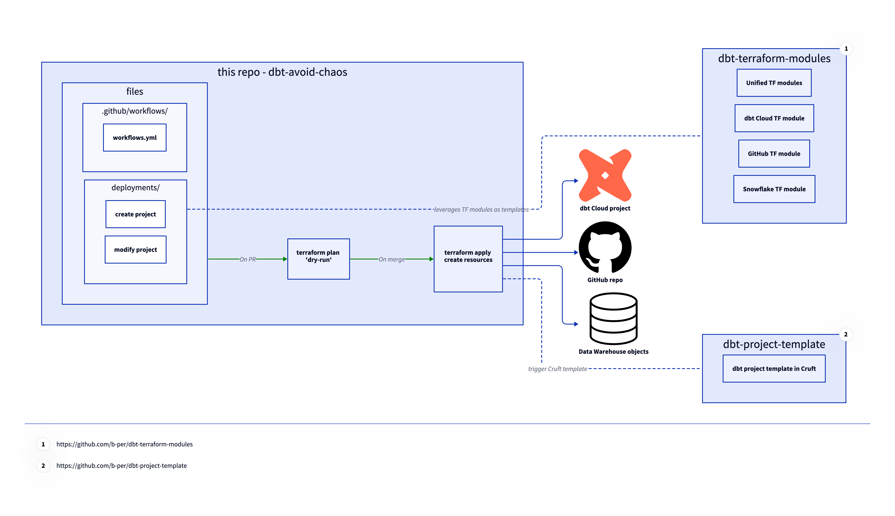

# dbt-avoid-chaos

This repo can be used to configure dbt projects and automatically deploy them.

It is part of a talk made at Coalesce 2023 in London.

## Overview of the demo

## GH actions configured

- on PR creation, if a project was created or modified under deployments, `terraform plan` is executed separately on every folder
  - if changes are identified in the `deployments` folder, the PR will be automatically updated with the output of `terraform plan`
- on merge to `main`, if a project was created or modified under deployments, `terraform apply -auto-approve` is executed separately on every folder
- it is possible to manually trigger a `dbt destroy` on a project in case we need to delete an existing project

## Env vars / Secrets used

Secrets have been set in GitHub for

- the Terraform backend (using Postgres in this example but could be used for any other backend)
- the Terraform sensitive variables
  - they are all created as `TF_VAR_terraform_var_name`, like `TF_VAR_DBT_TOKEN`

## dbt projects config

The current configuration leverages

- some Terraform modules avialble on the repo [b-per/dbt-terraform-modules](https://github.com/b-per/dbt-terraform-modules)
  - those modules are used to create a repository, database objects and a dbt Cloud project
- a dbt project template, compatible with [Cruft](https://cruft.github.io/cruft/) and available at [b-per/dbt-project-template](https://github.com/b-per/dbt-project-template)

## Tips

To remove a project

1. trigger a manual `terraform destroy` action for the project to be removed
2. remove the files from the repo

In case the files have already been rmoved it is possible to trigger a `terraform destroy` on a previous branch/commit that still had the code.
